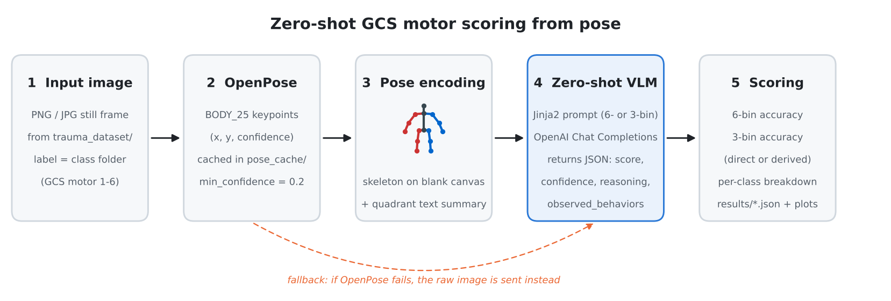
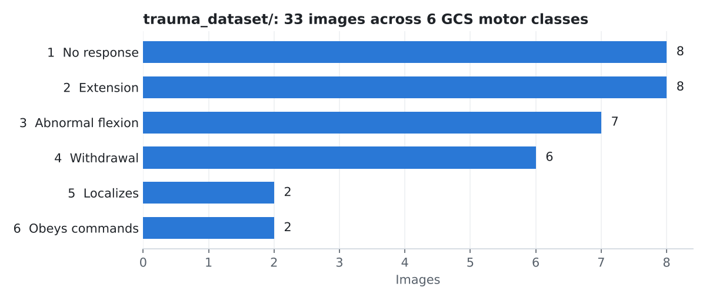

<h1 align="center">Automated Trauma Scoring</h1>

<p align="center">
  Zero-shot Glasgow Coma Scale (GCS) motor-response scoring with vision-language models,<br />
  using OpenPose skeletons instead of raw patient imagery.
</p>

<p align="center">
  
  
  
  
</p>

<p align="center">
  
</p>

> **Research use only.** This is not a medical device and must not be used for clinical
> assessment or decision-making. See the [Disclaimer](#disclaimer).

## Overview

The motor component of the Glasgow Coma Scale (GCS-M) is one of the most informative parts of a
trauma neurological exam, and it is judged largely from posture and limb movement. This repository
asks a narrow question: **can a general-purpose vision-language model (VLM) assign the GCS motor
score zero-shot, given only a body-pose representation of the patient?**

For every labelled image the pipeline:

1. runs [OpenPose](https://github.com/CMU-Perceptual-Computing-Lab/openpose) to extract BODY_25
   keypoints,
2. re-draws the pose as a colour-coded stick figure on a blank canvas and writes a short text
   summary of where key joints are,
3. sends the skeleton image and the summary to one or more OpenAI chat models with a Jinja2 prompt,
4. parses the JSON answer and scores it against the folder label.

The VLM sees a skeleton rather than the photograph, which removes appearance cues (faces, skin,
clothing, setting) and forces the decision onto limb geometry. Two tasks are supported: the full
**6-bin** GCS motor scale and a simplified **3-bin** grouping.

## Task: GCS motor response classes

Classes are defined in `config.yaml` (`dataset.categories`) and map one-to-one onto folders in
`trauma_dataset/`.

| GCS-M | Folder                | Response                                     | 3-bin group                   |
| :---: | --------------------- | -------------------------------------------- | ----------------------------- |
|   1   | `1_no_response`       | No response to painful stimuli               | 1 · Unresponsive / Abnormal   |
|   2   | `2_extension`         | Abnormal extension (decerebrate posturing)   | 1 · Unresponsive / Abnormal   |
|   3   | `3_abnormal_flexion`  | Abnormal flexion (decorticate posturing)     | 1 · Unresponsive / Abnormal   |
|   4   | `4_normal_flexion`    | Withdrawal / flexion from pain               | 2 · Withdraws / Localizes     |
|   5   | `5_localizing`        | Localizes to pain                            | 2 · Withdraws / Localizes     |
|   6   | `6_obeys_commands`    | Obeys commands                               | 3 · Obeys Commands / Normal   |

**6-bin vs 3-bin**

- `--task 6bin` uses `prompts/zero_shot_gcs.j2`. The model returns `gcs_motor_score` (1–6). A
  3-bin score is also *derived* from that prediction with the mapping above (1–3 → 1, 4–5 → 2,
  6 → 3), so both accuracies are reported.
- `--task 3bin` uses `prompts/zero_shot_gcs_3bin.j2`. The model returns `gcs_motor_bin` (1–3)
  directly; this is the model's own 3-way decision, not a conversion. 6-bin accuracy is not
  computed for this task and is reported as N/A.

## Method

| Stage | What happens | Where |
| ----- | ------------ | ----- |
| **Pose extraction** | OpenPose is run on each image with `--write_json` and rendering disabled. Keypoint JSON is cached under `pose_cache/json/` and reused when `openpose.reuse_cache` is true. Only the **first person** OpenPose reports (`people[0]`) is used. | `pose_processor.py` |
| **Skeleton rendering** | BODY_25 limbs and joints with confidence ≥ `openpose.min_confidence` are drawn on a white canvas the size of the original image: left-side limbs blue, right-side limbs red, midline dark grey. Renders are saved under `pose_cache/renders/`. | `pose_processor.py` |
| **Pose summary** | Eight landmarks (neck, mid-hip, both wrists, knees and ankles) are each placed in a 3×3 grid (`left/center/right` × `upper/mid/lower`) with their confidence, plus a count of joints above threshold. This text is injected into the prompt as `{{ pose_summary }}`. | `pose_processor.py` |
| **Prompting** | The rendered Jinja2 prompt and the skeleton image (as a base64 data URL, `prompting.image_detail`) are sent via the OpenAI Chat Completions API to every model in `config.yaml`. The prompt asks for a JSON object with the score, `confidence`, `reasoning` and `observed_behaviors`. | `evaluate_gcs.py`, `prompts/` |
| **Fallback** | If OpenPose fails for an image, the **raw image** is sent instead and the record carries a `pose_error` field. | `evaluate_gcs.py` |
| **Scoring** | Responses are parsed (code fences stripped), compared to the folder label, and aggregated into overall, per-class and per-3-bin-group accuracy plus token usage. | `evaluate_gcs.py` |

Models are listed under `models:` in `config.yaml`. The committed configuration evaluates
`gpt-4.1-2025-04-14`; several GPT-5-family entries are present but commented out. For model names
starting with `gpt-5`, `temperature` is dropped and `max_tokens` is renamed to
`max_completion_tokens`.

## Dataset

`trauma_dataset/` contains **33 still frames** sorted by GCS motor score:

<p align="center">
  
</p>

The classes are imbalanced (2 images each for scores 5 and 6), so per-class accuracies for those
classes rest on very few samples.

**Provenance:** _TBD — source and licence of the images to be documented._

### Structure

```
trauma_dataset/
├── 1_no_response/
├── 2_extension/
├── 3_abnormal_flexion/
├── 4_normal_flexion/
├── 5_localizing/
└── 6_obeys_commands/
```

### Adding data

- Drop `.png`, `.jpg` or `.jpeg` files into the folder for their GCS motor score. The label comes
  from the folder; file names are not parsed.
- To add or rename a class, edit `dataset.categories` in `config.yaml` (`name` must match the
  folder, `gcs_motor_score` is the label).
- To use a dataset elsewhere, set `dataset.base_path`.
- Pose caches are keyed by the image's path relative to the dataset root, so replacing an image
  under the same name requires deleting its entry in `pose_cache/` (or setting
  `openpose.reuse_cache: false`).
- Only add images you are allowed to redistribute. Do not add images of real patients.

## Setup

**Requirements:** Python 3.10+, an OpenAI API key, and a working
[OpenPose](https://github.com/CMU-Perceptual-Computing-Lab/openpose) build with its BODY_25 model.

```bash
git clone https://github.com/helalaou/Automated_Trauma_Scoring.git
cd Automated_Trauma_Scoring

# Python environment: creates .venv/ and installs requirements.txt
./install.sh
source .venv/bin/activate

# API key
cp .env.example .env    # then set OPENAI_API_KEY in .env
```

The key can also be exported directly (`export OPENAI_API_KEY=...`). `evaluate_gcs.py` loads `.env`
automatically through `python-dotenv`.

**OpenPose** is not installed by `install.sh`. Build it following the upstream instructions, then
either put the binary on your `PATH` (the code looks for `openpose.bin`, `OpenPoseDemo.app` or
`openpose`) or set `openpose.binary_path` in `config.yaml`. If your build cannot find its models,
set `openpose.model_folder`. The evaluation refuses to start if no OpenPose binary is configured.

## Configuration

All settings live in `config.yaml`. Values of the form `${VAR}` are read from the environment.

| Key | Default | Meaning |
| --- | ------- | ------- |
| `openai.api_key` | `${OPENAI_API_KEY}` | API key, taken from the environment or `.env`. |
| `openai.base_url` | `null` | Optional alternative endpoint for an OpenAI-compatible API. |
| `openai.timeout` | `60` | Request timeout in seconds. |
| `models[].name` / `models[].parameters` | `gpt-4.1-2025-04-14`, `top_p: 1.0` | Models to evaluate and the parameters passed to the API. |
| `dataset.base_path` | `trauma_dataset` | Dataset root. |
| `dataset.categories` | 6 classes | Folder name, GCS motor score and description for each class. |
| `prompting.zero_shot_template` | `prompts/zero_shot_gcs.j2` | 6-bin prompt. |
| `prompting.zero_shot_3bin_template` | `prompts/zero_shot_gcs_3bin.j2` | 3-bin prompt. |
| `prompting.image_detail` | `high` | Image detail level sent to the API (`low`, `high`, `auto`). |
| `openpose.binary_path` | `null` | OpenPose executable; `null` searches `PATH`. |
| `openpose.model_folder` | `null` | Passed to OpenPose as `--model_folder` when set. |
| `openpose.output_dir` | `pose_cache` | Where keypoint JSON and skeleton renders are written. |
| `openpose.reuse_cache` | `true` | Skip OpenPose when cached keypoints exist. |
| `openpose.min_confidence` | `0.2` | Joints below this confidence are not drawn or summarised. |
| `openpose.strict` | `true` | `true`: OpenPose errors or missing keypoint files raise, which triggers the raw-image fallback. `false`: they are ignored and an empty skeleton is sent. |
| `evaluation.output_dir` | `results` | Where result and summary JSON files are written. |
| `evaluation.save_individual_responses` | `true` | Write per-image, per-model records. |
| `evaluation.save_summary` | `true` | Write aggregated metrics and print them. |
| `evaluation.generate_plots` | `true` | Write plots to `results/plots/` after the run. |
| `evaluation.logging.*` | enabled, `logs/` | JSONL log of every request and response; base64 images can be redacted and responses truncated. |

## Running

```bash
# 6-bin task with config.yaml (default)
./run.sh

# Choose the task: 6bin | 3bin | both
./run.sh --task 3bin
./run.sh --config my_config.yaml --task both

# Or set defaults through the environment
TASK=both CONFIG=config.yaml ./run.sh

# Equivalent direct call
python evaluate_gcs.py --config config.yaml --task 6bin
```

`run.sh` activates `.venv/` if present. With no arguments it uses `TASK` (default `6bin`),
`CONFIG` (default `config.yaml`) and `PYTHON` (default `python3`); with arguments it forwards them
unchanged to `evaluate_gcs.py`.

Each run calls the OpenAI API once per image per model, so a full 6-bin pass over the bundled
dataset is 33 requests per model.

### Outputs

| Path | Contents |
| ---- | -------- |
| `results/results_openpose_<task>_<timestamp>.json` | One record per image and model: label, prediction(s), correctness flags, confidence, reasoning, observed behaviours, raw response, token usage and pose metadata. |
| `results/summary_openpose_<task>_<timestamp>.json` | `timestamp`, `mode`, `total_images` and per-model `metrics` (6-bin and 3-bin accuracy, per-class and per-group accuracy, total tokens). The task is encoded in the file name. |
| `results/plots/` | Overall accuracy bar chart, per-class accuracy heatmap and grouped bars, and a confusion matrix per model. |
| `logs/llm_interactions_<timestamp>.jsonl` | Request, response and parsed-answer log. |
| `pose_cache/json/`, `pose_cache/renders/` | OpenPose keypoints and the skeleton images that were sent to the model. |

All of these are git-ignored.

To re-plot overall accuracy from an existing summary:

```bash
python plot_results.py --summary results/summary_openpose_6bin_<timestamp>.json
```

## Results

_TBD._ No result or summary files are committed to this repository (`results/` and `*.json` are
git-ignored), so no numbers are reported here yet. Run the evaluation as above to reproduce them;
the summary is printed to the console and saved under `results/`.

## Repository structure

```
.
├── evaluate_gcs.py            # Evaluation entry point: prompting, parsing, metrics, plots
├── pose_processor.py          # OpenPose runner, skeleton renderer and pose summariser
├── plot_results.py            # Re-plot overall accuracy from a saved summary
├── config.yaml                # Models, dataset classes, prompts, OpenPose and output settings
├── prompts/
│   ├── zero_shot_gcs.j2       # 6-bin prompt
│   └── zero_shot_gcs_3bin.j2  # 3-bin prompt
├── trauma_dataset/            # Labelled images, one folder per GCS motor score
├── docs/assets/               # README figures
├── install.sh                 # Create .venv/ and install requirements
├── run.sh                     # Convenience wrapper around evaluate_gcs.py
├── requirements.txt
├── .env.example
└── CITATION.cff
```

## Citation

A paper describing this work is in preparation. Until then, please cite the software (see
[`CITATION.cff`](CITATION.cff)):

```bibtex
@misc{elalaoui_automated_trauma_scoring,
  title        = {Automated Trauma Scoring: Zero-shot Glasgow Coma Scale Motor Scoring with Vision-Language Models},
  author       = {El Alaoui, Hamza},
  year         = {TBD},
  howpublished = {\url{https://github.com/helalaou/Automated_Trauma_Scoring}},
  note         = {Carnegie Mellon University. Paper: TBD}
}
```

## License

This repository does not currently include a license. Until one is added, all rights are reserved
by the author.

## Disclaimer

This software is a research prototype for studying how vision-language models reason about
posture. It is **not a medical device**, has not been clinically validated, and **must not be used
for diagnosis, triage, or any clinical decision**. Outputs can be wrong with high stated
confidence. Always assess the Glasgow Coma Scale in person according to your clinical protocols.

When OpenPose fails on an image, the original image is sent to a third-party API. Do not run this
pipeline on images of real patients or any protected health information.
